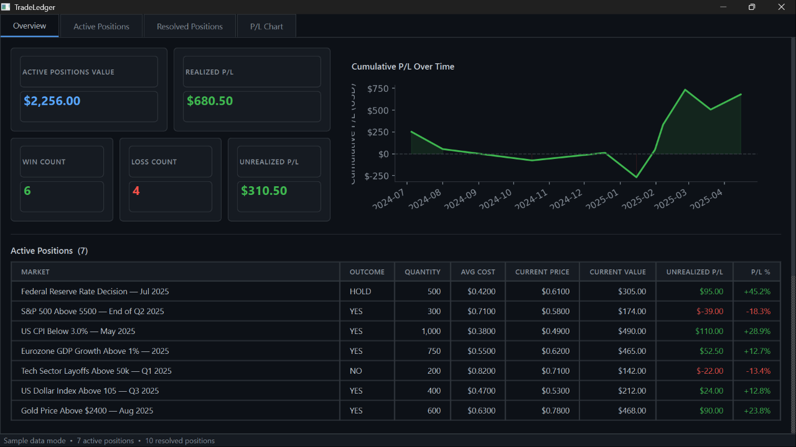

# TradeLedger

A local, read-only desktop application for tracking wallet-based trading positions, realized and unrealized P/L, active exposure, and total account value.

## Overview

TradeLedger helps you track open positions, review P/L, monitor wallet value, and estimate your total tracked value — all locally, without connecting to any exchange or wallet provider.

- **Overview dashboard** — Total Tracked Value, metric cards, wallet lookup, P/L chart
- **Active positions** — current value and unrealized P/L per position
- **Resolved positions** — realized P/L, win/loss status, and redemption tracking
- **P/L chart** — cumulative performance over time

**Read-only by design.** TradeLedger never asks for private keys, seed phrases, wallet signatures, or wallet connection permissions. Wallet lookup by public address only — no order placement, no transactions, no trading execution.

---

## Screenshots

### Overview Dashboard



---

## Tech Stack

| Layer     | Library          |
|-----------|------------------|
| UI        | PySide6 (Qt6)    |
| Storage   | SQLite (sqlite3) |
| Data      | pandas           |
| Charts    | matplotlib       |
| HTTP      | requests         |
| Tests     | pytest           |

---

## Setup

### 1. Clone

```bash
git clone https://github.com/0xJ4m3z/tradeledger.git
cd tradeledger
```

### 2. Create a virtual environment

```bash
python3 -m venv .venv
source .venv/bin/activate      # Windows: .venv\Scripts\activate
```

### 3. Install dependencies

```bash
pip install -r requirements.txt
```

### 4. Configure environment (optional)

```bash
cp .env.example .env
# Edit .env if you want a custom Polygon RPC endpoint
```

No API key is required. Basic wallet lookup (MATIC + USDC) uses the public Polygon RPC and CoinGecko price API.

---

## Run the app

```bash
python run.py
```

The app launches in **sample data mode**. Active positions are loaded from `sample_data/`. Each launch saves a position snapshot to `tradeledger.db` (gitignored).

To track wallet value: enter your Polygon wallet address in the Overview panel and click **Fetch Wallet Value**, or type a value manually and click **Set**.

---

## Run tests

```bash
pytest tests/ -v
```

---

## Project structure

```
tradeledger/
├── app/
│   ├── main.py                         # Entry point and app init
│   ├── database.py                     # SQLite snapshot storage
│   ├── models.py                       # ActivePosition, ResolvedPosition dataclasses
│   ├── services/
│   │   ├── pnl.py                      # P/L calculations and cumulative series
│   │   ├── metrics.py                  # Dashboard metric aggregation, Total Tracked Value
│   │   └── positions.py                # Filter and sort helpers
│   ├── adapters/
│   │   ├── sample_adapter.py           # Loads from local JSON (v0.1)
│   │   ├── wallet_adapter.py           # Read-only Polygon wallet value lookup (v0.2)
│   │   └── chain_adapter.py            # Stub for future read-only API
│   └── ui/
│       ├── main_window.py              # QMainWindow, tabs, global styles
│       ├── overview.py                 # Overview tab: cards, wallet panel, chart, positions
│       ├── wallet_panel.py             # Wallet address input, live fetch, manual fallback
│       ├── total_value_chart.py        # Total Tracked Value over time chart
│       ├── active_positions_table.py   # Active positions tab with search filter
│       ├── resolved_positions_table.py # Resolved positions tab with search filter
│       └── pnl_chart.py               # Cumulative P/L chart (matplotlib)
├── tests/
│   ├── test_pnl.py                     # P/L calculation tests
│   ├── test_positions.py               # Filter and sort tests
│   ├── test_sample_adapter.py          # Sample data integrity tests
│   ├── test_metrics_v2.py              # Total Tracked Value calculation tests
│   ├── test_wallet_adapter.py          # Wallet lookup tests (mocked network)
│   └── test_wallet_snapshot.py         # Wallet snapshot storage tests
├── sample_data/
│   ├── sample_wallet_positions.json    # Example active positions
│   └── sample_resolved_positions.json  # Example resolved positions
├── docs/
│   └── screenshots/
│       └── tradeledger_overview.png    # Overview dashboard screenshot
├── .env.example                        # Environment variable template
├── conftest.py                         # pytest path setup
├── run.py                              # Launch script
├── requirements.txt
└── README.md
```

---

## Overview cards

| Card | Description |
|------|-------------|
| Total Tracked Value | Active Positions Value + Wallet USD Value |
| Active Positions Value | Current market value of all open positions |
| Wallet USD Value | Polygon wallet value (MATIC + USDC), live or manual |
| Unrealized P/L | Floating profit/loss on active positions |
| Win Count | Number of resolved positions that paid out |
| Loss Count | Number of resolved positions that paid zero |

---

## Wallet value lookup

TradeLedger fetches wallet value using public, read-only APIs — no API key required:

- **Native MATIC balance** via public Polygon JSON-RPC (`https://polygon-rpc.com`)
- **USDC balance** (native USDC + USDC.e) via direct contract call
- **MATIC/USD price** via CoinGecko simple price API

If lookup fails, enter the wallet USD value manually. The app remains fully usable without live data.

---

## Roadmap

**v0.1 — Sample dashboard** ✓
- Sample data mode (no live API or wallet required)
- Overview tab: metric cards, cumulative P/L chart, active and resolved position lists
- Individual tabs for Active Positions and Resolved Positions with search filter
- P/L Chart tab
- Local SQLite snapshot storage
- pytest test suite

**v0.2 — Wallet value tracking (current)**
- Read-only Polygon wallet value lookup (MATIC + USDC, no API key required)
- Manual wallet USD value fallback
- Total Tracked Value = Active Positions Value + Wallet USD Value
- Total Tracked Value Over Time chart (from local snapshot history)
- 65 passing tests

**v0.3 — Read-only live market data**
- Read-only live active position lookup by wallet address
- Live market price updates
- No trading execution, no order placement, no private key storage
