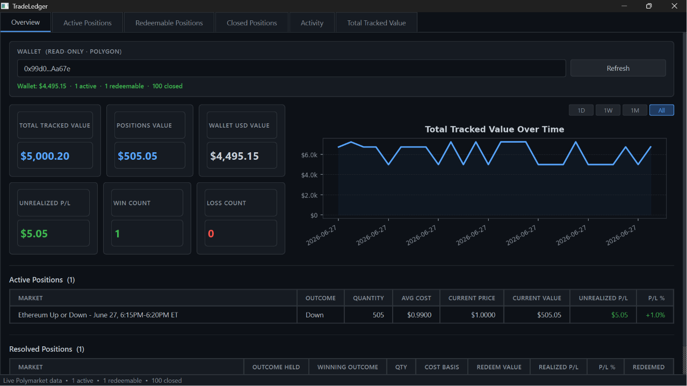

# TradeLedger

A local, read-only desktop application for tracking Polymarket positions, wallet balance, and total account value.

## Overview

TradeLedger lets you monitor your open positions, redeemable winnings, closed trade history, and activity feed — all locally, using public read-only APIs. No account login, no API key, no wallet connection required.

- **Overview** — wallet lookup, metric cards (Total Tracked Value, Wallet USD Value, Positions Value, Loss Watch, Realized P/L Today, Redeemable Count), Total Tracked Value mini chart
- **Active Positions** — all open positions currently exposed to market movement
- **Redeemable Positions** — won/resolved positions not yet claimed
- **Closed Positions** — redeemed or sold positions, most recent 100, with Refresh button
- **Activity** — full activity feed (trades, redeems, rewards, etc.), searchable, with Refresh button
- **Total Tracked Value** — full-size chart with 1D / 1W / 1M / All range buttons

**Read-only by design.** TradeLedger never asks for private keys, seed phrases, wallet signatures, or wallet connection permissions. Wallet lookup uses your public address only — no order placement, no transactions, no trading of any kind.

---

## Screenshots



---

## Terminology

| Term | Definition |
|------|------------|
| **Active / Open Positions** | Positions in unresolved markets; still exposed to price movement and can still win or lose |
| **Redeemable Positions** | Won/resolved positions that are claimable but not yet redeemed; still count toward Positions Value |
| **Closed Positions** | Already redeemed or sold; historical only, not counted in current tracked value |
| **Positions Value** | Current value of Active + Redeemable positions combined |
| **Total Tracked Value** | Wallet USD Value + Positions Value |

---

## Tech Stack

| Layer     | Library          |
|-----------|------------------|
| UI        | PySide6 (Qt6)    |
| Storage   | SQLite (sqlite3) |
| Data      | pandas           |
| Charts    | matplotlib       |
| HTTP      | requests         |
| Tests     | pytest           |

---

## Setup

### 1. Clone

```bash
git clone https://github.com/0xJ4m3z/tradeledger.git
cd tradeledger
```

### 2. Create a virtual environment

```bash
python3 -m venv .venv
source .venv/bin/activate      # Windows: .venv\Scripts\activate
```

### 3. Install dependencies

```bash
pip install -r requirements.txt
```

### 4. Configure environment (optional)

```bash
cp .env.example .env
# Edit .env if you want a custom Polygon RPC endpoint
```

No API key is required. Wallet lookup uses public Polygon RPCs; position and activity lookup use the public Polymarket Data API.

---

## Run the app

```bash
python run.py
```

The app launches in **sample data mode** — positions are loaded from `sample_data/`. Each launch saves a snapshot to `tradeledger.db` (gitignored).

To load live data: enter your Polygon wallet address in the Overview panel and click **Fetch Wallet Value**. This fetches your stablecoin balance, open positions, redeemable positions, most recent closed positions, and activity feed in one pass. The button becomes **Refresh** after the first successful fetch. Your wallet address is masked in the UI (`0x1234...abcde`) after a successful fetch.

---

## Run tests

```bash
pytest tests/ -v
```

All tests use mocked network calls — no live API access required.

---

## Project structure

```
tradeledger/
├── app/
│   ├── main.py                         # Entry point and app init
│   ├── database.py                     # SQLite snapshot storage
│   ├── models.py                       # ActivePosition, ResolvedPosition, UserActivity dataclasses
│   ├── services/
│   │   ├── pnl.py                      # P/L calculations and cumulative series
│   │   ├── metrics.py                  # Dashboard metric aggregation, Total Tracked Value
│   │   ├── positions.py                # Filter and sort helpers
│   │   └── chart_ranges.py             # filter_snapshots_by_range (1D/1W/1M/All)
│   ├── adapters/
│   │   ├── sample_adapter.py           # Loads from local JSON (v0.1 sample data)
│   │   ├── wallet_adapter.py           # Read-only Polygon stablecoin balance lookup
│   │   ├── polymarket_adapter.py       # Read-only Polymarket position + activity lookup
│   │   └── chain_adapter.py            # Stub for future read-only chain API
│   └── ui/
│       ├── main_window.py              # QMainWindow, tabs, global styles
│       ├── overview.py                 # Overview tab: cards, wallet panel, mini chart, positions
│       ├── wallet_panel.py             # Wallet address input, fetch/refresh, signals
│       ├── total_value_chart.py        # Total Tracked Value chart widget (with range buttons)
│       ├── active_positions_table.py   # Active Positions tab with search filter
│       ├── resolved_positions_table.py # Redeemable / Closed Positions tabs with search filter
│       └── activity_table.py           # Activity tab with search filter and color-coded types
├── tests/
│   ├── test_pnl.py                     # P/L calculation tests
│   ├── test_positions.py               # Filter and sort tests
│   ├── test_sample_adapter.py          # Sample data integrity tests
│   ├── test_metrics_v2.py              # Total Tracked Value calculation tests
│   ├── test_wallet_adapter.py          # Wallet lookup tests (mocked network)
│   ├── test_wallet_snapshot.py         # Wallet snapshot storage tests
│   ├── test_polymarket_adapter.py      # Polymarket position + activity lookup tests (mocked)
│   └── test_chart_ranges.py            # Chart range filter tests
├── sample_data/
│   ├── sample_wallet_positions.json    # Example active positions
│   └── sample_resolved_positions.json  # Example resolved positions
├── docs/
│   └── screenshots/
│       └── tradeledger_overview.png    # v0.1 overview screenshot
├── .env.example                        # Environment variable template
├── conftest.py                         # pytest path setup
├── run.py                              # Launch script
├── requirements.txt
└── README.md
```

---

## Overview cards

| Card | Description |
|------|-------------|
| Total Tracked Value | Wallet USD Value + Positions Value |
| Wallet USD Value | Polygon wallet USDC.e + pUSD balance (live, read-only) |
| Positions Value | Current value of all Active + Redeemable positions |
| Loss Watch | Count of open positions with negative unrealized P/L, minus acknowledged. "Acknowledge All" button marks current losers as known; new losers still appear. |
| Realized P/L Today | Net USDC cash flow for the current calendar day in Central Time (SELL proceeds + REDEEM + rebates − BUY costs). Resets at midnight CT. |
| Redeemable Count | Number of won positions pending redemption |

---

## Wallet and position lookup

TradeLedger fetches data using public, read-only APIs — no authentication required:

- **Wallet USD value** — sum of USDC.e + pUSD balances via Polygon JSON-RPC `balanceOf()` calls. Both are USD-pegged stablecoins; no price feed needed.
- **Active positions** — all open positions (including won-but-unredeemed), via `data-api.polymarket.com/positions`
- **Redeemable positions** — won markets pending redemption, via the same endpoint
- **Closed positions** — most recent 100 fully closed trades (redeemed, sold, or stop-loss triggered), via `data-api.polymarket.com/closed-positions`
- **Activity feed** — most recent 100 activity events (trades, redeems, rewards, deposits, etc.), via `data-api.polymarket.com/activity`

Tries multiple public Polygon RPCs automatically if one fails. Wallet address is masked in the UI after a successful fetch. The last-used address is saved locally (gitignored SQLite DB) so it prefills on the next launch. A background thread slowly fetches additional pages of closed position history and caches them locally.

---

## Privacy and safety

- **Read-only only.** No order placement, no transactions, no contract calls that write state.
- **Public address only.** TradeLedger never asks for private keys, seed phrases, wallet signatures, or wallet connection permissions.
- **No secrets committed.** `.env`, local database files, and virtual environments are gitignored.
- **Address masking.** After a successful fetch, the wallet address is displayed in shortened form (`0x1234...abcde`) in the UI.

---

## Roadmap

**v0.1 — Sample dashboard** ✓
- Sample data mode (no live API or wallet required)
- Overview tab: metric cards, active and resolved position lists
- Individual tabs for Active Positions and Resolved Positions with search filter
- Local SQLite snapshot storage
- pytest test suite

**v0.2 — Live wallet + position + activity tracking** ✓
- Read-only Polygon wallet value (USDC.e + pUSD, no API key required)
- Live Polymarket position lookup: active, redeemable, closed (most recent 100)
- Activity tab: full activity feed (trades, redeems, rewards, etc.), searchable
- Total Tracked Value = Wallet USD Value + Positions Value
- Total Tracked Value Over Time chart with 1D / 1W / 1M / All range buttons
- Full-size Total Tracked Value chart tab
- Refresh button (overview, closed positions tab, activity tab)
- Wallet address masked in UI after fetch for privacy
- 130 passing tests

**v0.3 — Daily monitoring (current)**
- Remember last wallet address: prefills masked on next launch (gitignored local DB)
- Auto-refresh every 5 min checkbox (default off); shows "Last updated HH:MM:SS"
- Loss Watch card: count of unacknowledged open losing positions; "Acknowledge All" button
- Realized P/L Today card: net USDC flow for the current CT calendar day
- Redeemable Count card replacing Win/Loss/Unrealized P/L cards
- Closed positions background cache: backfill thread fetches pages 3-7 slowly (2s delays)
- 175 passing tests

**v0.4 — Planned**
- Notes per market
- Export to CSV
- Cumulative realized P/L chart
- No trading execution, no order placement, no private key storage
