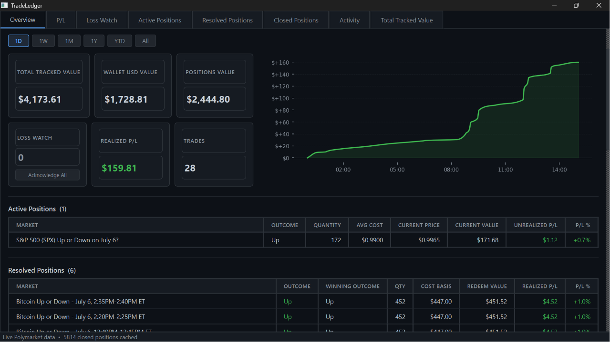

# TradeLedger

A local, read-only desktop application for tracking Polymarket positions, wallet balance, and total account value.

## Overview

TradeLedger lets you monitor your open positions, resolved winnings, closed trade history, and activity feed - all locally, using public read-only APIs. No account login, no API key, no wallet connection required.

- **Overview** - wallet lookup, time-range filter (1D / 1W / 1M / 1Y / YTD / All), metric cards (Total Tracked Value, Wallet USD Value, Positions Value, Loss Watch, Realized P/L, Trades), cumulative realized P/L line chart with hover, live positions grid
- **Loss Watch** - list of open positions with negative unrealized P/L; acknowledge known losers to track new ones
- **Active Positions** - all open positions currently exposed to market movement
- **Resolved Positions** - won/resolved markets not yet redeemed; still counted in Positions Value
- **Closed Positions** - fully settled trades (redeemed or sold), with infinite scroll to load history
- **Activity** - full activity feed (trades, redeems, rewards, etc.), searchable, with infinite scroll
- **Total Tracked Value** - full-size chart with 1D / 1W / 1M / All range buttons

**Read-only by design.** TradeLedger never asks for private keys, seed phrases, wallet signatures, or wallet connection permissions. Wallet lookup uses your public address only - no order placement, no transactions, no trading of any kind.

---

## Screenshots



---

## Terminology

| Term | Definition |
|------|------------|
| **Active Positions** | Positions in unresolved markets; still exposed to price movement |
| **Resolved Positions** | Won/resolved positions pending redemption; still counted in Positions Value |
| **Closed Positions** | Fully settled positions (redeemed or sold); historical only |
| **Positions Value** | Current value of Active + Resolved positions combined |
| **Total Tracked Value** | Wallet USD Value + Positions Value |
| **Realized P/L** | Net profit/loss from closed positions in the selected time range |

---

## Tech Stack

| Layer     | Library          |
|-----------|------------------|
| UI        | PySide6 (Qt6)    |
| Storage   | SQLite (sqlite3) |
| Data      | pandas           |
| Charts    | matplotlib       |
| HTTP      | requests         |
| Tests     | pytest           |

---

## Setup

### 1. Clone

```bash
git clone https://github.com/0xJ4m3z/tradeledger.git
cd tradeledger
```

### 2. Create a virtual environment

```bash
python3 -m venv .venv
source .venv/bin/activate      # Windows: .venv\Scripts\activate
```

### 3. Install dependencies

```bash
pip install -r requirements.txt
```

### 4. Configure environment (optional)

```bash
cp .env.example .env
# Edit .env if you want a custom Polygon RPC endpoint
```

No API key is required. Wallet lookup uses public Polygon RPCs; position and activity lookup use the public Polymarket Data API.

---

## Run the app

```bash
python run.py
```

The app launches in **sample data mode** - positions are loaded from `sample_data/`. Each launch saves a snapshot to `tradeledger.db` (gitignored).

To load live data: enter your Polygon wallet address in the Overview panel and click **Fetch Wallet Value**. This fetches your stablecoin balance, open positions, resolved positions, closed positions, and activity feed in one pass. The button becomes **Refresh** after the first successful fetch. Your wallet address is masked in the UI (`0x1234...abcde`) after a successful fetch.

**Your wallet address is remembered.** On next launch the masked address prefills automatically and a live fetch starts immediately. Address is stored only in the local `tradeledger.db` file (gitignored).

**Auto-refresh (optional).** Enable the "Auto-refresh every 5 min" checkbox to keep data current. The last-updated time is shown next to the checkbox. Refreshes merge new data without wiping scroll-loaded history.

---

## Run tests

```bash
pytest tests/ -v
```

All tests use mocked network calls - no live API access required.

---

## Project structure

```
tradeledger/
├── app/
│   ├── main.py                         # Entry point and app init
│   ├── database.py                     # SQLite: snapshots, settings, closed positions cache
│   ├── models.py                       # ActivePosition, ResolvedPosition, UserActivity dataclasses
│   ├── services/
│   │   ├── pnl.py                      # P/L calculations and cumulative series
│   │   ├── pnl_today.py                # Range-aware realized P/L from closed positions
│   │   ├── pnl_series.py               # Cumulative P/L chart data builder (pure, testable)
│   │   ├── metrics.py                  # Dashboard metric aggregation, Total Tracked Value
│   │   ├── loss_watch.py               # Loss Watch: filter losing positions, count unacknowledged
│   │   ├── positions.py                # Filter and sort helpers
│   │   └── chart_ranges.py             # filter_snapshots_by_range (1D/1W/1M/All)
│   ├── adapters/
│   │   ├── sample_adapter.py           # Loads from local JSON (sample data)
│   │   ├── wallet_adapter.py           # Read-only Polygon stablecoin balance lookup
│   │   ├── polymarket_adapter.py       # Read-only Polymarket position + activity lookup
│   │   └── chain_adapter.py            # Stub for future read-only chain API
│   └── ui/
│       ├── main_window.py              # QMainWindow, tabs, global styles
│       ├── overview.py                 # Overview tab: range filter, cards, chart, positions grid
│       ├── wallet_panel.py             # Wallet input, fetch/refresh, auto-refresh, background threads
│       ├── total_value_chart.py        # Total Tracked Value chart widget (with range buttons)
│       ├── pnl_chart.py                # Cumulative P/L line chart with hover crosshair (Overview)
│       ├── active_positions_table.py   # Active Positions tab with search filter
│       ├── resolved_positions_table.py # Resolved / Closed Positions tabs with infinite scroll
│       ├── activity_table.py           # Activity tab with infinite scroll and color-coded types
│       └── loss_watch_tab.py           # Loss Watch tab with acknowledge controls
├── tests/
│   ├── test_pnl.py                     # P/L calculation tests
│   ├── test_pnl_today.py               # Range-aware realized P/L tests
│   ├── test_positions.py               # Filter and sort tests
│   ├── test_sample_adapter.py          # Sample data integrity tests
│   ├── test_metrics_v2.py              # Total Tracked Value calculation tests
│   ├── test_wallet_adapter.py          # Wallet lookup tests (mocked network)
│   ├── test_wallet_snapshot.py         # Wallet snapshot storage and address isolation tests
│   ├── test_wallet_persistence.py      # Last wallet and Loss Watch acknowledgement persistence
│   ├── test_polymarket_adapter.py      # Polymarket position + activity lookup tests (mocked)
│   ├── test_closed_cache.py            # Closed positions cache: upsert, dedup, limit tests
│   ├── test_cache_hydration.py         # Scroll persistence, startup hydration, and merge logic tests
│   ├── test_loss_watch.py              # Loss Watch filter and count tests
│   ├── test_chart_ranges.py            # Chart range filter tests
│   ├── test_pnl_ranges.py              # Range/timezone logic, partial data detection
│   ├── test_pnl_series.py              # Cumulative P/L chart data builder tests
│   └── test_position_cache.py          # Wallet-isolated cache tests (active/resolved/closed/activity)
├── sample_data/
│   ├── sample_wallet_positions.json    # Example active positions
│   └── sample_resolved_positions.json  # Example resolved positions
├── docs/
│   └── screenshots/
│       └── tradeledger_v0.2_overview.png
├── .env.example                        # Environment variable template
├── conftest.py                         # pytest path setup
├── run.py                              # Launch script
├── clear_cache.py                      # Developer utility: wipe local cache (preserves wallet address setting)
├── requirements.txt
└── README.md
```

---

## Overview cards

| Card | Description |
|------|-------------|
| Total Tracked Value | Wallet USD Value + Positions Value |
| Wallet USD Value | Polygon wallet USDC.e + pUSD balance (live, read-only) |
| Positions Value | Current value of all Active + Resolved positions |
| Loss Watch | Count of open positions with negative unrealized P/L that have not been acknowledged. "Acknowledge All" marks current losers as known; new losers still appear. |
| Realized P/L | Net profit/loss from closed positions in the selected time range. Uses `redeem_value − cost_basis` so losses (redeem at $0) are correctly counted. Prefixed with `~` when loaded data may be incomplete for the range. |
| Trades | Count of closed positions in the selected time range. Prefixed with `~` when loaded data may be incomplete. |

The **1D / 1W / 1M / 1Y / YTD / All** range buttons above the cards and chart control all of these at once: the closed positions grid in the overview, the Realized P/L card, the Trades card, and the cumulative P/L line chart.

---

## P/L calculation rules

### Source of truth

Realized P/L uses **closed positions** (`ResolvedPosition.realized_pnl`), not activity events. This ensures losses are correctly counted: when a position expires worthless, `redeem_value = 0`, so `realized_pnl = redeem_value − cost_basis = −cost_basis`.

Activity events (BUY/SELL/REDEEM) are used only in the legacy activity-based functions retained for backward compatibility. They are not used for the Overview cards.

### Timezone

All calendar-day boundaries use **America/New_York (ET)** - Eastern Time, handles EST (UTC-5) and EDT (UTC-4) automatically via the system timezone database.

### Range definitions

| Button | Definition |
|--------|-----------|
| **1D** | Current calendar day from midnight ET to now |
| **1W** | Trailing 7 days from now |
| **1M** | Trailing 30 days from now |
| **1Y** | Trailing 365 days from now |
| **YTD** | January 1 midnight ET to now |
| **All** | All loaded data (no date filter) |

### Partial data detection

Closed positions are loaded newest-first (most recent 100 on initial fetch, then page-by-page via scroll or background backfill). If the **oldest loaded record** still falls within the selected range window, there may be older records in the same window not yet fetched.

When partial data is detected, the Realized P/L and Trades cards are prefixed with **`~`** to indicate the number may be understated. Scrolling down in the Closed Positions tab loads more history and will eventually clear the `~` prefix once data extends beyond the range cutoff.

`All` is never marked partial - it means "all currently loaded data" by definition.

---

## P/L chart

The Overview chart shows **cumulative realized P/L over time** for the selected range. It is a line chart, not a bar chart.

- **Starts at $0** at the range start date (range cutoff for fixed ranges; one day before the oldest closed position for "All"). The line always anchors at zero.
- **Final value equals the Realized P/L card.** The rightmost point is always `sum(realized_pnl)` for the same filtered set of closed positions.
- **Same-date aggregation.** Multiple closed positions on the same calendar day are summed to one net data point before building the cumulative series.
- **Color.** Green line and fill when the final value ≥ $0; red when negative.
- **Hover crosshair.** Move the mouse over the chart to see a vertical crosshair, a dot on the line, and a tooltip showing the date and cumulative P/L at that point (`+$X.XX` / `-$X.XX`).
- **X-axis format** adapts to the range: times for 1D, month-day for 1W/1M, month-year for 1Y/YTD/All.
- **Single data point.** If only one date has closed positions, the chart shows the anchor + that one point (a straight line from $0 to the final value). This is honest - no interpolation.
- **No data.** If no closed positions exist for the selected range, the chart shows "No closed positions in this range" as a text label.

Chart data is built by `app/services/pnl_series.py` (`build_pnl_series`), a pure function with no Qt or matplotlib dependencies. It is fully covered by `tests/test_pnl_series.py`.

---

## Local caching

TradeLedger caches position and activity data locally in the SQLite database (`tradeledger.db`, gitignored) so the app populates instantly on startup - no waiting for a live fetch before you can see your positions.

### What is cached (per wallet address)

| Cache | Key | Strategy |
|-------|-----|----------|
| Active positions | wallet_address | Replace-all on each fetch |
| Resolved positions | wallet_address | Replace-all on each fetch |
| Closed positions | wallet_address + position_key | Insert-or-ignore (dedup); accumulates over time |
| Activity events | wallet_address + event_key | Insert-or-ignore (dedup); accumulates over time |

**Active and resolved positions** are always stale after the app closes - they snapshot the last known state and are replaced entirely on the next live fetch.

**Closed positions and activity** are additive: deduplication ensures the same event is never stored twice. The initial API fetch, background backfill pages, and scroll-loaded pages all go through the same `upsert_*_cache` path, so loading more history just adds to the cache without creating duplicates.

### Dedup keys

- Closed position: `f"{market}|{outcome_held}"` - cost_basis is intentionally excluded; the API and activity-derived sources compute it slightly differently due to float rounding, so including it caused false duplicates
- Activity event: `f"{timestamp}|{type}|{side}|{size:.6f}"`

### Startup behavior

1. The last-used wallet address is read from the DB.
2. All four caches are loaded immediately in `MainWindow.__init__`.
3. The status bar shows **"Loaded from cache • X active • Y resolved • Z closed • Refreshing…"**
4. The Overview P/L chart and metric cards are pre-populated from cached data (`seed_from_cache`) - the 1D chart already shows intraday steps from cached REDEEM events.
5. `WalletPanel` auto-triggers a live fetch in the background (deferred with `QTimer.singleShot`).
6. When the live fetch completes, **new activity rows are merged into the existing list** - the cached history is never discarded. The same-wallet re-confirmation does not clear cached data.
7. All tabs update with fresh data; the status bar clears the "Refreshing…" suffix.

**First run / new wallet:** If no cache exists for the wallet, sample data is shown briefly until the live fetch completes.

### Cache invalidation

There is no explicit TTL. Active and resolved caches are replaced on every successful live fetch. Closed and activity caches only grow (dedup-protected). Switching wallets reads a separate, isolated cache for the new address - wallets never share cached rows.

---

## Wallet and position lookup

TradeLedger fetches data using public, read-only APIs - no authentication required:

- **Wallet USD value** - sum of USDC.e + pUSD balances via Polygon JSON-RPC `balanceOf()` calls
- **Active positions** - all open positions via `data-api.polymarket.com/positions`
- **Resolved positions** - won markets pending redemption via the same endpoint
- **Closed positions** - fully settled trades via `data-api.polymarket.com/closed-positions`; initial 100 on fetch, then infinite scroll in the Closed Positions tab; a background thread backfills older pages and caches them locally
- **Activity feed** - recent activity events via `data-api.polymarket.com/activity`; initial 100 on fetch, then infinite scroll loads more as you scroll down

Tries multiple public Polygon RPCs automatically if one fails. Wallet address is masked in the UI after a successful fetch. The last-used address is saved locally (gitignored SQLite DB) so it prefills on the next launch.

**Refresh behavior:** auto-refresh and manual refresh only prepend new records - existing scroll-loaded data is preserved. Switching range buttons or waiting for backfill to complete does not reset loaded history.

---

## Privacy and safety

- **Read-only only.** No order placement, no transactions, no contract calls that write state.
- **Public address only.** TradeLedger never asks for private keys, seed phrases, wallet signatures, or wallet connection permissions.
- **No secrets committed.** `.env`, local database files (`*.db`), and virtual environments are gitignored.
- **Address masking.** After a successful fetch, the wallet address is displayed in shortened form (`0x1234...abcde`) in the UI.
- **Local storage only.** The wallet address is stored only in the gitignored local `tradeledger.db` file - never sent to any TradeLedger server (there is none).

---

## Roadmap

**v0.1 - Sample dashboard** ✓
- Sample data mode (no live API or wallet required)
- Overview tab: metric cards, active and resolved position lists
- Individual tabs for Active Positions and Resolved Positions with search filter
- Local SQLite snapshot storage
- pytest test suite

**v0.2 - Live wallet + position + activity tracking** ✓
- Read-only Polygon wallet value (USDC.e + pUSD, no API key required)
- Live Polymarket position lookup: active, resolved, closed (most recent 100)
- Activity tab: full activity feed (trades, redeems, rewards, etc.), searchable
- Total Tracked Value = Wallet USD Value + Positions Value
- Total Tracked Value Over Time chart with 1D / 1W / 1M / All range buttons
- Full-size Total Tracked Value chart tab
- Wallet address masked in UI after fetch for privacy
- 130 passing tests

**v0.3 - Daily monitoring** ✓
- **Remembered wallet address** - prefills masked on next launch; immediate auto-fetch on startup
- **Auto-refresh** - optional 5-minute auto-refresh checkbox; shows last-updated timestamp
- **Loss Watch tab and card** - open positions with negative unrealized P/L; "Acknowledge All" button
- **Realized P/L card** - net profit/loss from closed positions using `redeem_value − cost_basis`; correctly counts losses where winning outcome pays $0
- **Trades card** - count of closed positions in the selected range
- **1D / 1W / 1M / All range filter** - controls overview closed positions grid, Realized P/L, and Trades cards simultaneously
- **Active / Resolved / Closed terminology** - positions are exactly one of: active (open), resolved (won, not yet redeemed), or closed (settled); never shown in two categories at once
- **Resolved Positions tab** - shows won markets pending redemption; counted in Positions Value
- **Closed positions infinite scroll** - Closed Positions tab loads more pages on scroll-to-bottom, identical to Activity tab
- **Activity infinite scroll** - Activity tab loads additional pages as you scroll down
- **Background backfill** - closed position history is fetched in the background and cached locally (SQLite); cache survives restarts
- **Merge-on-refresh** - refresh prepends new records without wiping scroll-loaded data; range filters continue working on the full loaded history
- **REDEEM event display** - Activity tab shows Win/Loss for REDEEM events (Polymarket API returns empty outcome/side for redeems)
- **Wallet-address-tagged snapshots** - chart never shows data from a different wallet; stale same-day snapshots are cleared on first fetch
- 196 passing tests

**v0.3.1 - P/L accuracy audit + cache fixes + chart** ✓
- **ET timezone** - all calendar-day calculations use America/New_York (was: Chicago); 1D = today ET midnight to now
- **1Y and YTD ranges** - added to range bar alongside 1D / 1W / 1M / All
- **Partial data detection** - Realized P/L and Trades cards show `~` prefix when loaded data may not cover the full range
- **Closed positions as P/L source** - explicitly documented; `filter_closed_by_range` extracted to service layer
- **Correct cost basis calculation** - Polymarket's `totalBought` field is shares, not USDC; `cost_basis` is now correctly computed as `totalBought × avgPrice`; `redeem_value = cost_basis + realizedPnl`; previously these were wrong, causing significantly inflated P/L figures
- **Fixed closed-position dedup key** - key is now `market|outcome_held` only; previously included `cost_basis`, which caused float-precision differences between API and activity-derived sources to produce two DB rows for the same trade (duplicate entries in the Closed Positions tab and double-counted P/L)
- **Fixed SQLite schema migration** - closed positions cache now uses a composite `UNIQUE(wallet_address, position_key)` constraint; a startup migration rebuilds legacy DBs and reassigns rows with missing wallet addresses
- **Fixed closed-position persistence** - scroll-loaded and backfill-loaded pages now correctly persist across app restarts; the old single-column unique constraint silently dropped all inserts on existing DBs
- **Fixed `derive_closed_from_activity`** - REDEEM events in the activity feed often have an empty outcome field; the correct outcome is now inferred from the corresponding BUY events; stale zero-cost rows in the DB are replaced when fresh activity data is available
- **Event-based 1D chart** - cumulative realized P/L; starts at $0 at midnight ET; intraday steps at each closed position's actual close timestamp; interactive hover crosshair; green/red fill
- **Same-date aggregation** - multiple closed positions on the same calendar day sum to one net data point for 1W+ chart ranges
- **Wallet-isolated local caching** - active, resolved, closed, and activity data cached per wallet in SQLite; app pre-populates from cache on startup before the live fetch completes
- **Full cache persistence for scroll-loads** - scroll-loaded activity and closed position pages are upserted to SQLite; previously only the initial fetch and backfill were persisted
- **Activity merge on refresh** - live refresh merges new records into the existing in-memory list instead of replacing it; cached history is never discarded by a refresh
- **Same-wallet refresh guard** - `_on_wallet_address_changed` only clears data when the wallet address genuinely changes; same-wallet re-confirmation on startup no longer clears chart data
- **Insert-or-ignore dedup** - closed positions and activity events accumulate without duplicates across scroll-loads, backfill pages, and refreshes
- **Debug logging** - set `TRADELEDGER_DEBUG=1` to enable verbose data-flow logs via Python's `logging` module
- **433 passing tests** - including `test_cache_hydration.py` covering scroll-page persistence, in-memory merge logic, startup hydration, and P/L accuracy scenarios

**v0.3.2 - Performance + UI polish** ✓
- **Non-blocking chart rendering** - P/L chart computation runs in a background thread (`_ChartWorker`); switching to 1Y or All no longer freezes the UI
- **Overview row cap** - closed positions grid in the Overview panel renders at most 100 rows; shows "N more - see Closed Positions tab" when over the cap; eliminates the multi-second hang when switching to large ranges
- **Auto-refresh on by default** - "Auto-refresh every 5 min" checkbox is enabled at startup; user can untick if desired
- **Removed wallet amount from status line** - wallet USD value is already shown in the dedicated card; removed the redundant "Wallet: $X" prefix from the status line below the address field
- **Realized P/L sign formatting** - positive P/L displays as `$97.46` (no `+` prefix); negative still displays as `-$97.46`; color (green/red) conveys direction
- **Loss Watch card** - removed "unacknowledged losing positions" subtitle; count and Acknowledge All button remain
- **Fixed remaining in-memory dedup keys** - two remaining occurrences in the overview used `(market, outcome_held, cost_basis)` for dedup; changed to `(market, outcome_held)` to match the DB key and prevent false duplicates when API and activity sources compute cost_basis differently
- **433 passing tests**

**v0.4.0 - Polymarket market links** ✓
- **Right-click to open on Polymarket** - every position row in every table (Active, Resolved, Closed, Loss Watch, P/L daily drill-down, Overview grid) has a right-click context menu: "Open on Polymarket" opens the market page in the system browser
- **Ctrl+click** as an alternative to right-click in all QTableWidget-based tables
- **Slug captured from API** - `eventSlug` / `slug` fields captured for active, resolved, and closed positions; stored in the closed-positions SQLite cache with migration-safe `ALTER TABLE`
- **Background slug backfill** - on each fetch, a background thread re-fetches historical closed-position pages and fills any NULL slug values non-destructively (never overwrites an existing slug)
- **P/L tab** - dedicated P/L tab with 1D / 1W / 1M / 1Y / YTD / All range buttons, cumulative P/L chart, and daily P/L breakdown table; double-click or "View Details" opens a per-day drill-down dialog showing all closed positions for that calendar day
- **Closed positions sorted newest-first** throughout the app
- **491 passing tests**

**v0.5 - Planned**
- Notes per market
- Export to CSV
- No trading execution, no order placement, no private key storage
